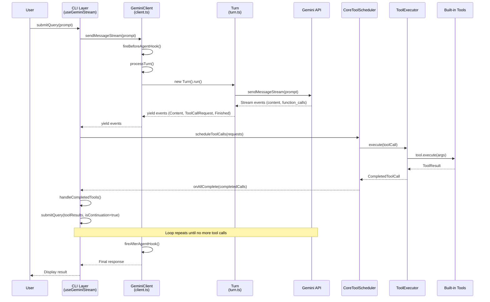
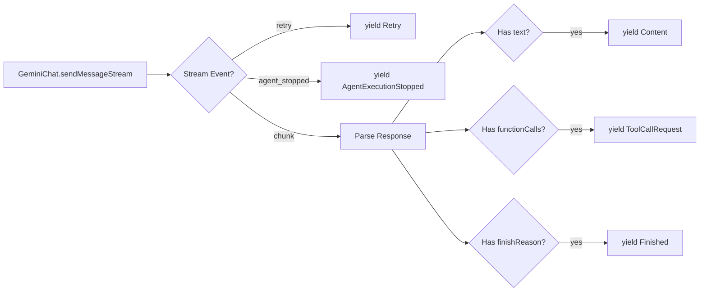
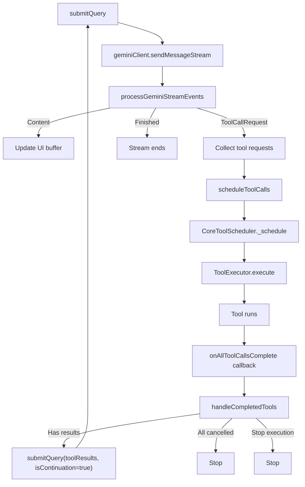

# Analisa Agentic Loop pada Gemini CLI

## Ringkasan

Agentic loop pada Gemini CLI adalah mekanisme inti yang memungkinkan model LLM untuk **secara otonom** mengeksekusi tool, membaca hasilnya, lalu melanjutkan mengambil keputusan — berulang kali — sampai task selesai atau terjadi terminasi. Arsitektur ini terbagi di **dua layer**: **Core** (engine) dan **CLI** (consumer/UI).

---

## Arsitektur High-Level



---

## Layer 1: Core Engine

### 1.1 Entry Point — `GeminiClient.sendMessageStream()`

> Source: `packages/core/src/core/client.ts` (lines 789–925)

Ini adalah **entry point utama** agentic loop di core layer. Fungsi ini:

1. **Reset state** per prompt baru (loop detector, hook state)
2. **Fire `beforeAgent` hook** — bisa stop/block eksekusi sebelum mulai
3. **Delegate ke `processTurn()`** via `yield*` (generator delegation)
4. **Fire `afterAgent` hook** — bisa stop eksekusi atau memaksa continue via blocking decision
5. **Cleanup** hook state di `finally` block

```typescript
// Simplified flow
async *sendMessageStream(request, signal, prompt_id, turns = 100) {
  // 1. Hook: Before Agent
  const hookResult = await this.fireBeforeAgentHookSafe(request, prompt_id);
  
  // 2. Delegate to processTurn
  turn = yield* this.processTurn(request, signal, prompt_id, boundedTurns);
  
  // 3. Hook: After Agent  
  const afterResult = await this.fireAfterAgentHookSafe(request, prompt_id, turn);
  
  // 4. If after-hook blocks, continue the loop!
  if (afterResult?.isBlockingDecision()) {
    yield* this.sendMessageStream(continueRequest, signal, prompt_id, boundedTurns - 1);
  }
}
```

> **IMPORTANT**: `sendMessageStream` bisa **memanggil dirinya sendiri secara rekursif** melalui `yield*` delegation — ini adalah mekanisme inti recursion di core layer.

### 1.2 Per-Turn Processing — `GeminiClient.processTurn()`

> Source: `packages/core/src/core/client.ts` (lines 550–787)

Setiap "turn" adalah satu kali round-trip ke LLM. `processTurn` menangani:

| Step | Aksi | Location |
|------|------|----------|
| 1 | **Session turn limit check** (MAX_TURNS = 100) | `client.ts:562` |
| 2 | **Context compression** jika token mendekati limit | `client.ts:577` |
| 3 | **Token estimation** — hitung apakah request muat di context window | `client.ts:590` |
| 4 | **IDE context injection** (editor state, cursor info) | `client.ts:617` |
| 5 | **Loop detection check** (turn-level) | `client.ts:637` |
| 6 | **Model routing** — pilih model terbaik via router | `client.ts:656` |
| 7 | **Stream LLM response** via `Turn.run()` | `client.ts:681` |
| 8 | **Loop detection check** (event-level, per stream event) | `client.ts:691` |
| 9 | **Invalid stream recovery** — retry jika stream corrupt | `client.ts:726` |
| 10 | **Next-speaker check** — apakah model perlu continue? | `client.ts:758` |

**Recursion point**: Jika "next speaker" adalah model, atau jika stream invalid, `processTurn` memanggil `sendMessageStream` lagi via `yield*`:

```typescript
// Next-speaker check triggers recursion
if (nextSpeakerCheck?.next_speaker === 'model') {
  turn = yield* this.sendMessageStream(
    [{ text: 'Please continue.' }],
    signal, prompt_id, boundedTurns - 1
  );
}
```

### 1.3 Single LLM Call — `Turn.run()`

> Source: `packages/core/src/core/turn.ts` (lines 253–404)

`Turn` mengelola **satu kali panggilan** ke Gemini API dan mengubah raw response menjadi stream event terstruktur:



Event types yang di-yield:

| Event Type | Trigger | Makna |
|------------|---------|-------|
| `Content` | Model mengeluarkan teks | Tampilkan ke user |
| `Thought` | Model berpikir (thinking mode) | Tampilkan sebagai thinking indicator |
| `ToolCallRequest` | Model memanggil function | Jadwalkan eksekusi tool |
| `Finished` | Stream selesai dengan finishReason | Turn selesai |
| `LoopDetected` | Pola repetitif terdeteksi | Hentikan loop |
| `ContextWindowWillOverflow` | Token melebihi limit | Hentikan sebelum overflow |
| `ChatCompressed` | History dikompresi | Informasi ke UI |

---

## Layer 2: CLI Consumer

### 2.1 Stream Consumer — `useGeminiStream`

> Source: `packages/cli/src/ui/hooks/useGeminiStream.ts`

Hook React yang mengkonsumsi events dari core dan mengelola **tool execution lifecycle** di sisi CLI:



### 2.2 Tool Scheduling — `CoreToolScheduler`

> Source: `packages/core/src/core/coreToolScheduler.ts`

Tool scheduler mengelola lifecycle setiap tool call melalui state machine:

```
Scheduled → Validating → (AwaitingApproval?) → Executing → Success/Error/Cancelled
```

Key features:
- **Parallel execution**: Beberapa tool bisa jalan bersamaan
- **Confirmation flow**: Tool berbahaya (edit file, shell) meminta approval user
- **Queue management**: `_processNextInQueue()` secara sequential memproses antrian tool
- **Abort support**: User bisa cancel kapan saja via Escape key

### 2.3 The Feedback Loop — `handleCompletedTools()`

> Source: `packages/cli/src/ui/hooks/useGeminiStream.ts` (lines 1600–1791)

Ini adalah **titik kritis** yang menutup loop. Setelah semua tool selesai:

1. Filter tool yang sudah terminal (success/error/cancelled)
2. Kumpulkan `responseParts` dari semua tool (berisi `functionResponse`)
3. **Panggil `submitQuery()` lagi** dengan tool results sebagai continuation
4. Model menerima hasil tool → bisa memutuskan memanggil tool lagi → loop berlanjut

```typescript
// The critical feedback line:
submitQuery(responsesToSend, { isContinuation: true }, prompt_ids[0]);
```

---

## Mekanisme Safety & Control

### 3.1 Loop Detection — `LoopDetectionService`

> Source: `packages/core/src/services/loopDetectionService.ts`

Tiga strategi deteksi loop:

| Strategi | Cara Kerja | Threshold |
|----------|-----------|-----------|
| **Tool Call Repetition** | Hash nama+args tool, deteksi `N` panggilan identik | 5 calls |
| **Content Repetition** | Sliding window chunk hashing pada output teks | 10 repetitions |
| **LLM-based Check** | Setelah 30 turns, tanya model lain apakah terdeteksi loop | Confidence-based |

### 3.2 Context Window Management

| Mekanisme | Source | Fungsi |
|-----------|--------|--------|
| **Chat Compression** | `chatCompressionService.ts` | Summarize history lama untuk save token |
| **Tool Output Masking** | `toolOutputMaskingService.ts` | Replace output tool besar dengan placeholder |
| **Token Estimation** | `client.ts:590` | Estimasi token sebelum kirim, tolak jika overflow |
| **Bounded Turns** | `client.ts:570` | Hard limit MAX_TURNS = 100 per sequence |

### 3.3 Permission & Policy Engine

> Source: `packages/core/src/policy/types.ts`

Gemini CLI memiliki **4 approval modes**:

| Mode | Behavior |
|------|----------|
| `DEFAULT` | Ask user untuk tool berbahaya, auto-approve read-only |
| `AUTO_EDIT` | Auto-approve file edits, ask untuk shell |
| `YOLO` | Auto-approve semua tool tanpa konfirmasi |
| `PLAN` | Read-only mode, tidak ada writes/executes |

Di atas approval modes, terdapat **PolicyEngine** yang mengelola:
- **PolicyRules**: Per-tool `allow`/`deny`/`ask_user` dengan priority, `argsPattern` (regex), dan `toolAnnotations`
- **SafetyCheckerRules**: External/in-process checkers (e.g., `allowed-path`, `conseca`) per tool
- **HookCheckerRules**: Safety checkers untuk hook executions
- **Mode-scoped rules**: Rules bisa dibatasi ke specific `ApprovalMode[]`
- **Source tracking**: `PolicySettings` dari `policyPaths`, workspace policies, MCP trust config

### 3.4 Hook System

> Source: `packages/core/src/policy/types.ts`, `packages/core/src/core/client.ts`

**Agent-level hooks** (dalam agentic loop):

| Hook | Timing | Capability |
|------|--------|------------|
| `beforeAgent` | Sebelum turn pertama | Block, stop, atau inject context tambahan |
| `afterAgent` | Setelah turn selesai | Stop eksekusi, clear context, atau force continue |

**Hook sources** (4 levels): `system`, `user`, `project`, `extension` — masing-masing melewati safety checkers sebelum dijalankan.

### 3.5 Model Routing

`ModelRouterService` (source: `packages/core/src/routing`) menentukan model mana yang digunakan per-turn:
- **Stickiness**: Setelah model dipilih untuk sequence, model yang sama digunakan untuk turn berikutnya
- **Router decision**: Untuk turn pertama, router memilih berdasarkan context

### 3.6 Hierarchical Memory System

> Source: `packages/core/src/services/contextManager.ts`, `packages/core/src/utils/memoryDiscovery.ts`

`ContextManager` mengelola memory dalam **3 tier + JIT**:

| Tier | Source | Fungsi |
|------|--------|--------|
| **Global** | `~/.gemini/GEMINI.md` | Personal preferences, global rules |
| **Extension** | Extension-bundled `GEMINI.md` files | Extension-specific context |
| **Project** | Workspace `GEMINI.md` + upward traversal | Project conventions, architecture docs |
| **JIT (on-demand)** | Per-subdirectory discovery saat tool akses file | Contextual rules yang di-load lazy |

Tambahan: MCP instructions injected bersama project memory, `@import` untuk modular config, `save_memory` tool untuk persist knowledge, folder trust gating.

---

## Agent Architecture

> Source: `packages/core/src/agents/registry.ts`, `packages/core/src/agents/local-executor.ts`

`AgentRegistry` mengelola discovery, loading, dan lifecycle agent:

### Built-in Agents

| Agent | Fungsi |
|-------|--------|
| **Codebase Investigator** | Explore dan analisa codebase |
| **CLI Help** | Menjawab pertanyaan tentang CLI |
| **Generalist** | General-purpose sub-agent |
| **Browser Agent** | Web browsing via MCP |

### Agent Types

| Type | Deskripsi |
|------|----------|
| **Local** | Berjalan in-process, memiliki own TAOR loop via `local-executor.ts` |
| **Remote** | Terhubung via A2A protocol |
| **Custom** | User-defined agents dari filesystem |

Key features:
- **Agent acknowledgement**: User harus acknowledge custom agents sebelum bisa digunakan
- **Model config overrides**: Setiap agent bisa specify model preference
- **Tool scoping**: Agents bisa membatasi tools yang tersedia
- **Policy integration**: Agent tools masuk ke PolicyEngine dengan `PRIORITY_SUBAGENT_TOOL`

---

## Non-Interactive Mode

`nonInteractiveCli.ts` (source: `packages/cli/src/nonInteractiveCli.ts`) mengimplementasi loop sederhana tanpa UI React:

```typescript
// Simplified non-interactive loop
const responseStream = geminiClient.sendMessageStream(query, signal, prompt_id);
for await (const event of responseStream) {
  // Handle events, schedule tools...
}
// Tool results → sendMessageStream again
```

---

## Ringkasan Flow Lengkap

```
User Input
    │
    ▼
submitQuery() ◄────────────────────────────────┐
    │                                           │
    ▼                                           │
GeminiClient.sendMessageStream()                │
    │                                           │
    ├── beforeAgent hook                        │
    │                                           │
    ▼                                           │
processTurn()                                   │
    │                                           │
    ├── Context compression                     │
    ├── Token estimation                        │
    ├── Loop detection (turn-level)             │
    ├── Model routing                           │
    │                                           │
    ▼                                           │
Turn.run() → Gemini API                         │
    │                                           │
    ├── Content → UI display                    │
    ├── ToolCallRequest → collect               │
    ├── LoopDetected → halt                     │
    ├── Finished → end turn                     │
    │                                           │
    ▼                                           │
[Next-speaker check]                            │
    ├── "model" → recursive sendMessageStream   │
    │                                           │
    ▼                                           │
afterAgent hook                                 │
    │                                           │
    ▼                                           │
scheduleToolCalls() → CoreToolScheduler         │
    │                                           │
    ▼                                           │
ToolExecutor.execute() → Run tools              │
    │                                           │
    ▼                                           │
handleCompletedTools()                          │
    │                                           │
    └── submitQuery(results, isContinuation) ───┘
```
