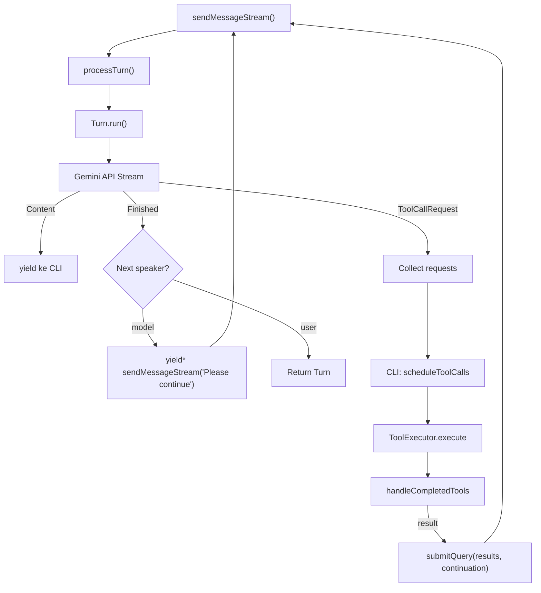

# Analisa Perbandingan Arsitektur: Gemini CLI vs Claude Code

Berdasarkan analisa source code Gemini CLI dan artikel [Claude Code Architecture (Reverse Engineered)](https://vrungta.substack.com/p/claude-code-architecture-reverse).

---

## Ringkasan Filosofi

| Aspek | Gemini CLI | Claude Code |
|-------|-----------|-------------|
| **Pendekatan** | Multi-layer engine dengan routing intelligence | "Dumb loop" harness, semua kecerdasan di model |
| **Loop Model** | Recursive generator delegation (`yield*`) | TAOR (Think-Act-Observe-Repeat) |
| **Arsitektur** | Monorepo: `core` (engine) + `cli` (UI) | Harness: runtime shell membungkus LLM |
| **Filosofi Tool** | Rich typed tools dengan schema FunctionDeclaration | Capability Primitives (Read/Write/Execute/Connect) |
| **Ekstensi** | Programmatic (TypeScript hooks + MCP) | Declarative (`.md` + `.json` files) |

---

## 1. Agentic Loop — Jantung Arsitektur

### Gemini CLI: Recursive Generator Loop



**Karakteristik:**
- Loop terjadi di **dua level**: internal (core, via `yield*` recursion) dan external (CLI, via `submitQuery` callback)
- Generator-based (`AsyncGenerator<ServerGeminiStreamEvent>`): events di-stream satu per satu
- Turn counter bounded (`MAX_TURNS = 100`)
- **Next-speaker check**: model terpisah (lightweight) menentukan apakah model utama perlu continue
- Recursion di core via delegated generators menjaga context stack tetap linear

### Claude Code: TAOR Loop

```
while (turns < maxTurns) {
    response = await model.chat(messages)     // THINK
    if (response.stop_reason !== "tool_use")  // DECIDE
        break                                  
    results = await executeTools(tool_calls)  // ACT
    messages.push(results)                    // OBSERVE
    turns++
}                                             // REPEAT
```

**Karakteristik:**
- Simple while-loop (~50 lines)
- Model sendiri yang memutuskan kapan berhenti (via `stop_reason !== "tool_use"`)
- Tidak ada "next-speaker check" terpisah — stopping decision ada di model
- `maxTurns` sebagai hard cap

### Perbedaan Kunci

| Dimensi | Gemini CLI | Claude Code |
|---------|-----------|-------------|
| **Loop structure** | Recursive generators (`yield*`) | Simple while-loop |
| **Lines of loop code** | ~400 lines (client.ts) + ~200 (turn.ts) | ~50 lines |
| **Stopping decision** | External next-speaker LLM check | Model's own `stop_reason` |
| **Event model** | Stream events via `AsyncGenerator` | Direct function returns |
| **Turn limit** | `MAX_TURNS = 100` (hard-coded constant) | `maxTurns` (configurable) |
| **Where tools execute** | Split: core yields requests, CLI executes | Same process: harness executes |
| **Complexity** | Tinggi — routing, hooks, compression interleaved | Rendah — "dumb loop" by design |

> **NOTE**: Gemini CLI memisahkan **event production** (core) dari **event consumption** (CLI), memungkinkan multiple consumers (interactive mode, non-interactive pipe mode, Zed integration). Claude Code menggabungkan keduanya dalam satu loop.

---

## 2. Tool Architecture

### Gemini CLI: Typed Schema Tools

```
Tool Registry        FunctionDeclaration (JSON Schema)
    │                      │
    ▼                      ▼
CoreToolScheduler    ToolExecutor.execute()
    │                      │
    ├── Scheduled          ├── Validate invocation
    ├── Validating         ├── shouldConfirmExecute()
    ├── AwaitingApproval   ├── Fire tool
    ├── Executing          └── Return ToolResult
    ├── Success/Error/Cancelled
    └── onAllComplete → feedback loop
```

- ~20+ built-in tools: `read-file`, `edit`, `write-file`, `shell`, `grep`, `glob`, `web-fetch`, `web-search`, `mcp-tool`, `ask-user`, `save_memory`, etc.
- Setiap tool memiliki `FunctionDeclaration` (JSON Schema) yang dikirim ke model
- **State machine** per tool call: Scheduled → Validating → AwaitingApproval → Executing → terminal
- Tools bisa model-dependent (description berubah per model)

### Claude Code: Capability Primitives

```
Read    → ReadFile, SearchFiles, ListFiles, GrepSearch
Write   → WriteFile, EditFile
Execute → Bash (universal adapter)
Connect → MCP servers
```

- **4 kategori primitif**, bukan individual tools
- `Bash` sebagai **universal adapter** — model bisa menjalankan apapun via shell
- Semantic tool search untuk 100+ MCP tools (inject yang relevan saja)

### Perbedaan Kunci

| Dimensi | Gemini CLI | Claude Code |
|---------|-----------|-------------|
| **Jumlah built-in tools** | ~20+ named tools | ~10 primitives + Bash |
| **Tool philosophy** | Each tool is specialized | Bash as universal adapter |
| **Schema format** | `FunctionDeclaration` (Gemini SDK) | Tool definitions in harness |
| **Lifecycle** | Full state machine per call | Direct execute/return |
| **Parallel execution** | ✅ via `CoreToolScheduler` | ✅ implied |
| **MCP support** | ✅ via `mcp-tool.ts` | ✅ via Connect primitive |
| **Tool search** | All tools sent to model | Semantic search (inject relevant only) |

> **IMPORTANT**: Perbedaan filosofis besar: Claude Code percaya Bash sudah cukup sebagai "universal tool" — menghapus kebutuhan banyak tool wrapper. Gemini CLI memilih typed tools yang lebih terstruktur dan aman.

---

## 3. Loop Safety & Detection

### Gemini CLI: Tiga Strategi

| Strategi | Mekanisme | Threshold |
|----------|----------|-----------|
| **Tool Call Repetition** | Hash `name + args`, deteksi N panggilan identik | 5 calls |
| **Content Repetition** | Sliding window chunk hashing pada teks output | 10 chunks |
| **LLM-based Analysis** | Setelah 30 turns, tanya model lain apakah ada loop | Confidence-adaptive |

- `LoopDetectionService` — 600+ lines dedicated service
- User bisa **disable loop detection** per session via confirmation dialog
- Adaptive interval: check frequency meningkat seiring confidence naik
- Code blocks di-skip untuk mengurangi false positives

### Claude Code: Model-Driven Stopping

| Mekanisme | Deskripsi |
|-----------|-----------|
| **`maxTurns` cap** | Hard limit pada jumlah iterasi |
| **Model's `stop_reason`** | Model sendiri memutuskan "stop" vs "continue tool use" |
| **No explicit loop detection** | Tidak ada hashing atau pattern detection |

### Perbedaan Kunci

| Dimensi | Gemini CLI | Claude Code |
|---------|-----------|-------------|
| **Detection sophistication** | 3 layers (hash + content + LLM) | maxTurns cap only |
| **Who decides to stop** | Detection service + user confirmation | Model itself |
| **Dedicated code** | 600+ lines (`loopDetectionService.ts`) | ~1 line (`maxTurns` check) |
| **False positive handling** | Code block skip, user can disable | N/A |
| **LLM-based detection** | ✅ (calls separate model) | ❌ |
| **User control** | Can disable per session | Configure maxTurns |

> **TIP**: Gemini CLI **tidak mempercayai model** untuk berhenti sendiri — ia menggunakan external detection. Claude Code **mempercayai model** sepenuhnya (model-driven autonomy). Ini mencerminkan perbedaan filosofi fundamental.

---

## 4. Context Window Management

### Gemini CLI

| Mekanisme | Source | Fungsi |
|-----------|--------|--------|
| **Chat Compression** | `chatCompressionService.ts` | Summarize history lama |
| **Tool Output Masking** | `toolOutputMaskingService.ts` | Replace output besar dengan placeholder |
| **Token Estimation** | `client.ts` | Hitung token sebelum kirim, tolak jika overflow |
| **Context Window Overflow Event** | `turn.ts` | Yield event jika akan overflow |
| **MAX_TURNS** | `client.ts` | Hard limit 100 turns per sequence |

- Compression dipicu **per-turn** di `processTurn()`
- Jika compression gagal (inflate token count), flag `hasFailedCompressionAttempt` mencegah retry
- Tool output masking mengganti tool output besar untuk menghemat space

### Claude Code

| Mekanisme | Deskripsi |
|-----------|-----------|
| **Auto-compaction at ~50%** | Summarize transcript saat mendekati 50% kapasitas |
| **Sub-agent isolation** | Task berat di-fork ke context terpisah, return summary only |
| **Semantic search** | Untuk MCP tools, hanya inject definisi yang relevan |
| **PreCompact hook** | Inject context tambahan sebelum compaction |

### Perbedaan Kunci

| Dimensi | Gemini CLI | Claude Code |
|---------|-----------|-------------|
| **Compression trigger** | Per-turn automatic | At ~50% capacity |
| **Context isolation** | ❌ (single context) | ✅ Sub-agents fork context |
| **Tool output management** | Masking service (replace with placeholder) | N/A explicit |
| **Overflow handling** | Yield event + stop turn | Auto-compaction |
| **Compression failure handling** | Flag + skip subsequent attempts | Not documented |

> **WARNING**: Perbedaan terbesar: Claude Code memiliki **sub-agents yang mengisolasi context** — task berat berjalan di context window terpisah dan hanya mengembalikan summary. Gemini CLI beroperasi dalam **single context window** dengan compression sebagai satu-satunya mekanisme.

---

## 5. Hook & Extension System

### Gemini CLI: Programmatic Hooks

```
sendMessageStream()
    ├── fireBeforeAgentHook()  →  can: stop, block, inject context
    │       ↓
    │   processTurn() + Turn.run()
    │       ↓
    └── fireAfterAgentHook()   →  can: stop execution, clear context, force continue
```

- **2 agent-level hook points**: `beforeAgent` dan `afterAgent`
- Hooks diimplementasi dalam TypeScript via `MessageBus`
- **4 hook sources**: `system`, `user`, `project`, `extension`
- Hook execution melewati `HookCheckerRule` safety checkers
- Dapat **stop execution**, **clear context**, atau **inject additional context**
- Hook state tracked per `prompt_id`

### Claude Code: 8 Lifecycle Hook Points

```
SessionStart → UserPromptSubmit → PreToolUse → PermissionRequest 
    → PostToolUse → PostToolUseFailure → PreCompact → Stop → SessionEnd
```

- **8+ hook injection points** mencakup seluruh lifecycle
- Hooks adalah **deterministic scripts** (bukan LLM) — shell commands atau executables
- Configurable via JSON: matcher + command pattern
- Hooks bisa **transform input** (UserPromptSubmit), **block tools** (PreToolUse), **auto-approve** (PermissionRequest)

### Perbedaan Kunci

| Dimensi | Gemini CLI | Claude Code |
|---------|-----------|-------------|
| **Jumlah hook points** | 2 (before/after agent) | 8+ (full lifecycle) |
| **Hook language** | TypeScript (programmatic) | Shell scripts (declarative) |
| **Hook sources** | 4 (system/user/project/extension) | Not documented |
| **Safety checks** | ✅ HookCheckerRules per hook | ❌ |
| **Granularity** | Agent-level | Tool-level (per tool use) |
| **Can transform input** | ✅ (inject context) | ✅ (UserPromptSubmit) |
| **Can block tools** | ❌ (agent-level only) | ✅ (PreToolUse per tool) |
| **Audit capability** | Limited | Full (PostToolUse for every action) |
| **Configuration** | Code-based | JSON config files |

---

## 6. Memory System

### Gemini CLI

| Tier | Source | Fungsi |
|------|--------|--------|
| **Global** | `~/.gemini/GEMINI.md` | Personal preferences, global rules |
| **Extension** | Extension-bundled `GEMINI.md` files | Extension-specific context |
| **Project** | Workspace `GEMINI.md` + upward traversal | Project conventions, architecture |
| **JIT (on-demand)** | Per-subdirectory discovery saat tool akses file | Lazy-loaded contextual rules |
| **Chat history** | Maintained in `GeminiChat` | Active conversation |
| **Session recording** | `ChatRecordingService` | Persistent session logs |

Tambahan: `@import` processor untuk modular config, `save_memory` tool untuk persist knowledge, MCP instructions injection, folder trust gating.

### Claude Code: 6-Layer Memory

| Layer | Scope | Contoh |
|-------|-------|--------|
| 1. **Organization** | Team-wide policies | `CLAUDE.md` di repo root |
| 2. **Project** | Per-project conventions | `CLAUDE.md` di project folder |
| 3. **User Global** | Personal preferences | `~/.claude/MEMORY.md` |
| 4. **User Local** | Per-project preferences | Local overrides |
| 5. **Session** | Current conversation | In-memory transcript |
| 6. **Auto-Memory** | Agent learns your patterns | Agent writes to `MEMORY.md` |

### Perbedaan Kunci

| Dimensi | Gemini CLI | Claude Code |
|---------|-----------|-------------|
| **Memory layers** | 6 tiers (Global + Extension + Project + JIT + Chat + Session) | 6 formal layers |
| **Auto-learning** | ✅ via `save_memory` tool | ✅ Auto-Memory loop |
| **Organization-level** | ❌ (extension-level instead) | ✅ (team policies) |
| **Memory file** | `GEMINI.md` | `CLAUDE.md` / `MEMORY.md` |
| **JIT discovery** | ✅ (lazy load per-subdirectory) | ❌ |
| **Import system** | ✅ (`@import` in GEMINI.md) | ❌ |
| **Session persistence** | `ChatRecordingService` | Session checkpoint/fork/rollback |

---

## 7. Permission Model

### Gemini CLI

> Source: `packages/core/src/policy/types.ts`

| Mode | Behavior |
|------|----------|
| **DEFAULT** | Ask for tool confirmation on dangerous tools |
| **AUTO_EDIT** | Auto-approve file edits, ask for shell |
| **YOLO** | Auto-approve everything |
| **PLAN** | Read-only, no writes/executes |

Di atas modes, terdapat **PolicyEngine**:
- **PolicyRules**: Per-tool `allow`/`deny`/`ask_user` dengan priority, `argsPattern` (regex), `toolAnnotations`, mode-scoping
- **SafetyCheckerRules**: External/in-process checkers (e.g., `allowed-path`, `conseca`)
- **HookCheckerRules**: Safety checkers untuk hook executions
- **Source tracking**: From `policyPaths`, workspace policies, MCP trust config
- **Default decision**: `ASK_USER` jika no rules match

### Claude Code: 6 Permission Modes

```
Plan → Default → Auto-Edit → Full Auto → YOLO
               ↕
        Per-tool allow/deny/ask with glob patterns
```

| Mode | Trust Level |
|------|-------------|
| **Plan** | Read-only |
| **Default** | Ask for dangerous tools |
| **Auto-Edit** | Auto-approve file edits |
| **Full Auto** | Auto-approve most things |
| **YOLO** | Bypass all |
| **Custom** | Per-tool allow/deny/ask with glob patterns |

### Perbedaan Kunci

| Dimensi | Gemini CLI | Claude Code |
|---------|-----------|-------------|
| **Number of modes** | 4 (DEFAULT, AUTO_EDIT, YOLO, PLAN) | 6 modes |
| **Granularity** | Per-tool + argsPattern regex + priority | Per-tool + per-specifier + glob |
| **Policy engine** | ✅ Full PolicyEngine with rules + checkers | ✅ Multi-tiered whitelist resolver |
| **Glob patterns** | ❌ (uses regex argsPattern instead) | ✅ (`allow: "Edit:*.test.ts"`) |
| **Permission as hook** | ❌ | ✅ (`PermissionRequest` hook) |
| **Safety checkers** | ✅ External + in-process checkers | Not documented |

---

## 8. Multi-Agent Architecture

### Gemini CLI

| Komponen | Deskripsi |
|----------|-----------|
| **Agent Registry** | Load agents dari filesystem |
| **Agent Types** | Codebase Investigator, CLI Help, Generalist |
| **Local Executor** | Eksekusi agent lokal (43KB — complex) |
| **Sub-agent Tool** | Invoke sub-agent sebagai tool call |
| **A2A Server** | Experimental Agent-to-Agent server |

- Agents berjalan sebagai **tool calls** — model memanggil sub-agent tool
- `local-executor.ts` (43KB) adalah executor paling kompleks
- Agent Teams via experimental A2A server

### Claude Code: Isolation Spectrum

```
Same Context          Isolated Context
┌──────────┐          ┌──────────────┐
│  SKILLS  │          │  SUB-AGENTS  │
│ (inject) │          │ (own TAOR)   │
│ Zero cost│          │ Return summary│
└──────────┘          └──────────────┘
                      ┌──────────────┐
Separate Process      │ AGENT TEAMS  │
(tmux)                │ (parallel)   │
                      │ Task board   │
                      └──────────────┘
```

| Type | Context | Process | Communication |
|------|---------|---------|---------------|
| **Skills** | Same | Same | Direct injection |
| **Sub-Agents** | Isolated | Same (child) | Summary return |
| **Agent Teams** | Isolated | Separate (tmux) | Shared filesystem + task board |

### Perbedaan Kunci

| Dimensi | Gemini CLI | Claude Code |
|---------|-----------|-------------|
| **Isolation levels** | 1 (sub-agent as tool) | 3 (Skills → Sub-Agents → Teams) |
| **Context isolation** | Shared context | Sub-agents have isolated context |
| **Built-in agents** | 3 (Investigator, Help, Generalist) | 3 (Explore/Haiku, Plan, General) |
| **Parallel execution** | Agent Teams via A2A (experimental) | Agent Teams via tmux (experimental) |
| **Agent definition** | TypeScript code | YAML frontmatter in `.md` files |
| **Background execution** | ❌ | ✅ (Ctrl+B to background) |

---

## 9. Session Management

| Dimensi | Gemini CLI | Claude Code |
|---------|-----------|-------------|
| **Session recording** | `ChatRecordingService` saves JSONL | Session files with checkpoint |
| **Resume** | ✅ `resumeChat()` with history | ✅ Checkpoint/rollback/fork |
| **Git-like branching** | ❌ | ✅ (sessions like git branches) |
| **Compression on resume** | ✅ (compress before resume) | ✅ (compact on resume) |
| **DevTools** | ✅ Full DevTools server (Network + Console inspector) | ❌ Not documented |

---

## Tabel Ringkasan

| Failure Mode | Gemini CLI Solution | Claude Code Solution | Keunggulan |
|-------------|--------------------|--------------------|--------|
| **Runaway Loops** | 3-strategy detection (hash + content + LLM) | `maxTurns` + model-driven stop | Gemini — more sophisticated |
| **Context Collapse** | Chat compression + tool masking | Auto-compaction + sub-agent isolation | Claude — context isolation |
| **Permission Roulette** | 4 modes + PolicyEngine + safety checkers | 6 modes + glob patterns + hook | Tie — different approaches |
| **Amnesia** | 6-tier memory (Global/Ext/Project/JIT/Chat/Session) | 6-layer memory + auto-memory | Tie — comparable depth |
| **Monolithic Context** | Single context + compression + JIT loading | Sub-agents + Agent Teams | Claude — isolation spectrum |
| **Hard-Coded Behavior** | MCP + hooks (TypeScript) + extensions | Declarative (.md/.json) extensions | Claude — no-code friendly |
| **Black Box** | DevTools server (Network+Console) | 8 hook points for audit | Tie — different strengths |
| **Single-Threaded** | A2A server (experimental) | Agent Teams via tmux (experimental) | Tie — both experimental |

---

## Kesimpulan Arsitektural

### Gemini CLI Lebih Unggul Di:
1. **Loop detection** — 3-strategy detection vs simple maxTurns
2. **Developer observability** — Full DevTools server (selayaknya Chrome DevTools)
3. **Model routing** — Intelligent model selection per-turn
4. **Type safety** — TypeScript throughout with typed tool schemas
5. **Multi-consumer architecture** — Same core, multiple UIs (interactive, pipe, Zed)
6. **JIT memory** — Lazy per-subdirectory context discovery
7. **Safety checkers** — Pluggable external/in-process security checkers

### Claude Code Lebih Unggul Di:
1. **Context isolation** — Sub-agents dengan isolated TAOR loops
2. **Simplicity** — ~50 lines loop vs ~600 lines
3. **Extensibility** — Declarative (`.md`/`.json`) vs programmatic
4. **Hook coverage** — 8 lifecycle points vs 2
5. **Background execution** — Foreground/background agent mode
6. **Session branching** — Git-like checkpoint/fork/rollback

### Filosofi Berbeda, Tujuan Sama

| | Gemini CLI | Claude Code |
|---|-----------|-------------|
| **Trust in model** | Low — external verification | High — model-driven autonomy |
| **Engineering complexity** | High — defense-in-depth | Low — "dumb loop" harness |
| **Extensibility model** | Code-first | Config-first |
| **Context strategy** | Compress what exists | Isolate to prevent growth |
| **Architecture metaphor** | **Sophisticated engine** dengan banyak safety valve | **Thin harness** yang membiarkan model memimpin |
